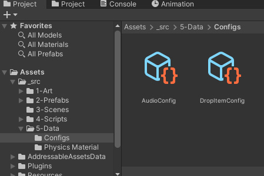
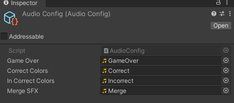
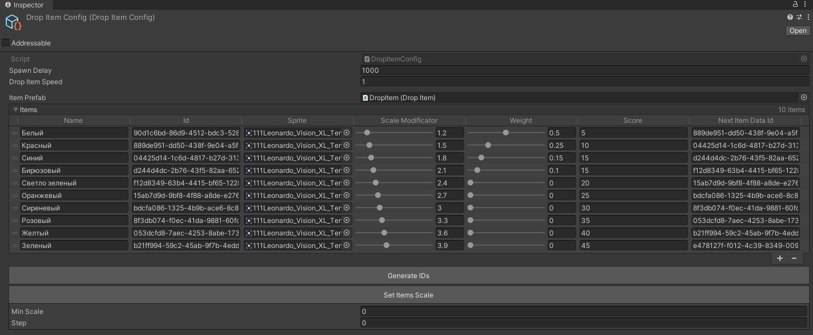

# Suika Game Engine
An engine for the implementation of games such as suika game. Still work in progress for new features. 
Now it contains basic functions.

### Demo

## How to use?

The configuration consists of two configs: audio and drop items config.

Insert the necessary sound effects into the fields according to the name of the fields.

The Drop Items config is used to configure the visual and dropout of objects.

1. Spawn Delay - wait this seconds for spawn new item.
2. Drop Item Speed - the speed of movement of objects with the mouse.
3. Name - this info only for you. Write what u want.
4. Id - generate Ids ONLY with button "Generate Ids". It generate and update all items in config.
5. Sprite - view of item.
6. Scale modificator - wich scale can be selected item.
7. Weight - the chance of an object appearing.
8. Score - how many points will a player get for merging objects of this type.
9. Next item data Id - Dont touch! This field filling after use button "Generate Ids".

You can use "Set Items Scale" function for faster change scale modificator for all items. Set min scale for first item and set step wich scale will be increased and push button.
